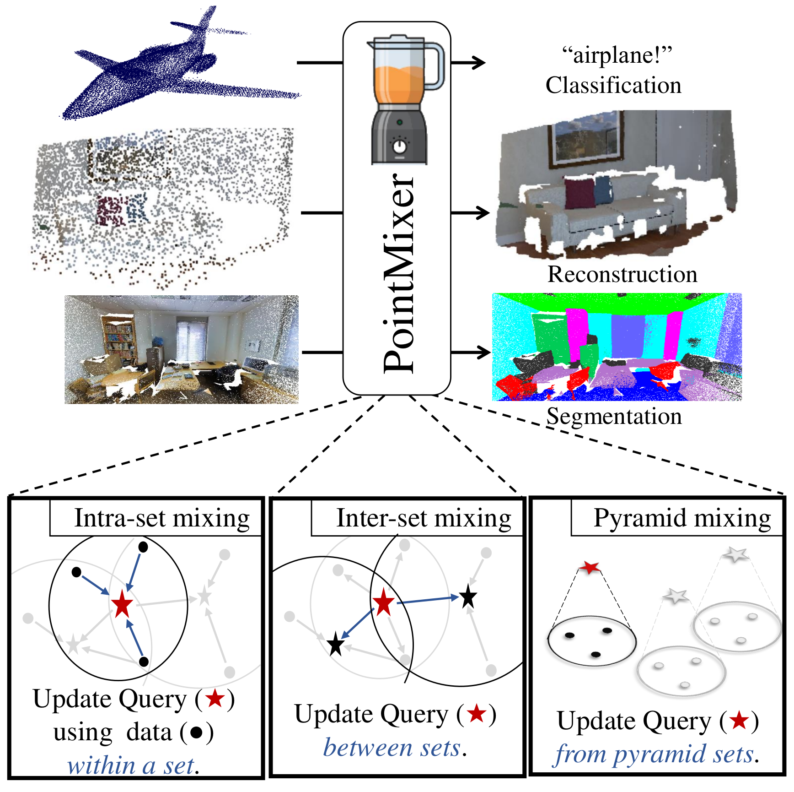

# PointMixer

Official pytorch implementation for "PointMixer" (Arxiv'21)  
[Jaesung Choe*](https://sites.google.com/view/jaesungchoe), [Chunghyun Park*], [Francois Rameau](https://rameau-fr.github.io/), and [In So Kweon](https://rcv.kaist.ac.kr). (*: equal contribution)

[Paper] [Project page] [Youtube]  

 
